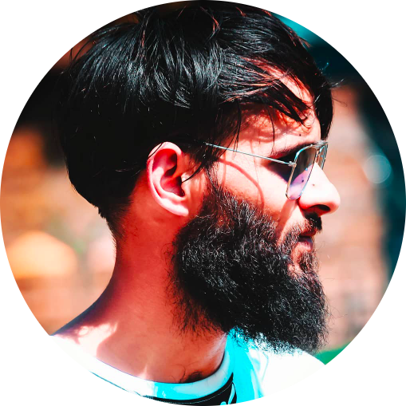

<h1 align="center">Hi there, I'm Shahid-Ul-Islam! 👋</h1>

<i>Data science — The bridge between chaos and clarity</i>

  

---

  
  
  
  
  
  
  

---

  

---

  

---

  

---

  

---

  

---

### Connect with Me

  
  
  
  
  

---

## About Me

I'm a **Computer Science Master's student** passionate about **problem-solving, AI, and data-driven technologies**. With a strong foundation in **Python, Machine Learning, and Data Science**, I love tackling complex challenges and building intelligent systems.

I specialize in **predictive modeling, AI/ML, and data visualization**, and I’m currently refining my skills by working on various **Data Science Projects**.

### What Drives Me?
- **Data & AI** – I love uncovering **insights** and making **data-driven** decisions.
- **Innovation** – Developing real-world applications.
- **Continuous Growth** – Always exploring **new technologies** and sharpening my expertise.

---
## Fun Facts
- I love turning data into actionable insights!
- Coffee and code fuel my creativity.
- Always excited to connect with like-minded techies.

---

  
   
  <b>Thanks for visiting my profile! ⭐️</b>

